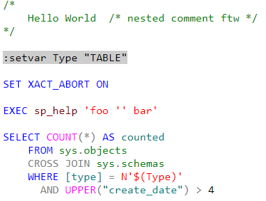

# Transact-SQL (T-SQL) - a language grammar for [highlight.js](https://highlightjs.org/)

## Demo

The below screenshot was captured from a [demo webpage](docs/demo.html) after dropping `highlight.min.js` to a `dist` folder.



## Usage

Simply include the [highlight.js](https://github.com/highlightjs/highlight.js) library in your webpage, then add this module.

### npm package

This module is hosted on npmjs.org as [highlight.js-tsql](https://www.npmjs.com/package/highlight.js-tsql).

### Static website or simple usage

Simply load this module after loading Highlight.js. You'll use the minified version found in the `dist` directory. This module is just a CDN build of the language, so it will register itself as the Javascript is loaded.

```html
<script type="text/javascript" src="/path/to/highlight.min.js"></script>
<script type="text/javascript" src="/path/to/highlightjs-tsql/dist/tsql.min.js"></script>
<link rel="stylesheet" href="/path/to/highlightjs-tsql/dist/ssms.min.css" />
<script type="text/javascript">
  hljs.highlightAll();
</script>
```

For more details of the usage see [Highlight.js main page](https://github.com/highlightjs/highlight.js#highlightjs).

## Authors

[David Simner](https://github.com/DavidSimner), [Greg Smulko](https://github.com/Greg-Smulko)

## Maintainers

[Greg Smulko](https://github.com/Greg-Smulko)

## Sponsor

Creation of this library was sponsored by [Redgate Software](http://redgate.com/).

## Contribution

Feel free to create issues or (even better) pull requests.

A good starting point for how to build and test your changes locally is [here](https://github.com/highlightjs/highlight.js/blob/master/extra/3RD_PARTY_QUICK_START.md).

## Links

- The official site for the Highlight.js library is <https://highlightjs.org/>.
- The Highlight.js GitHub project: <https://github.com/highlightjs/highlight.js>
- Learn more about T-SQL: <https://docs.microsoft.com/en-us/sql/t-sql/language-reference>
